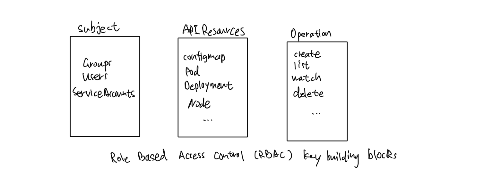
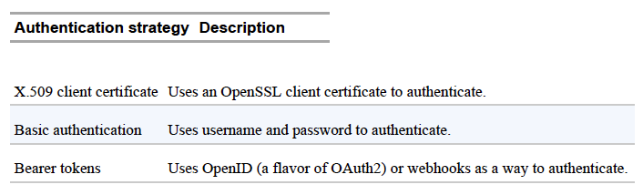

# Kubernetes CKA Note

## Cluster Architecture, Installation & Configuration

> RBAC defines policies for users, groups, and processes by allowing or
disallowing access to manage API resources. Enabling and configuring
RBAC is mandatory for any organization with a strong emphasis on
security. 

> For the exam, you need to understand the involved RBAC API
resource types and how to create and configure them in different scenarios.

RBAC helps with implementing a variety of use cases:
- Establishing a system for users with different roles to access a set of
Kubernetes resources.

- Controlling processes running in a Pod and the operations they can
perform via the Kubernetes API.
- Limiting the visibility of certain resources per namespace.



- Subject: The user or process that wants to access a resource.
- Resource: The Kubernetes API resource type e.g. a Deployment or
node.
- Verb: The operation that can be executed on the resource e.g. creating
a Pod, or deleting a Service.

### There are different ways to create an user:



#### Creation of a user with OpenSSL

1. Log into the Kubernetes master node and create a temporary directory
that will hold the generated keys.

```bash
$ mkdir cert && cd cert
```

2. Create a private key using the openssl executable. Provide an expressive file name

```bash
$ openssl genrsa -out johndoe.key 2048
```

3. Create a certificate sign request (CSR) in a file with extension `.csr`
```bash
$ openssl req -new -key johndoe.key -out johndoe.csr -subj \
"/CN=johndoe/O=cka-study-guide"
```

`CN`: username (CN)

`O`: group (O)

4. Lastly, sign the CSR with the Kubernetes cluster certificate authority(CA). The CA can usually be found in the directory `/etc/kubernetes/pki` and needs to contain the files `ca.crt`
and `ca.key`.
e.g. The following command signs the CSR and makes it valid for 364 days.

```bash
openssl x509 -req -in johndoe.csr -CA ~/.minikube/ca.crt   -CAkey ~/.minikube/ca.key -CAcreateserial -out johndoe.crt -days 364
```

5. Create the user in Kubernetes by setting a user entry in `kubeconfig` for `johndoe`. Point to the **CRT** and **key** file. Set a context entry in `kubeconfig` for `johndoe`.

```bash
$ kubectl config set-credentials johndoe --clientcertificate=
johndoe.crt \
--client-key=johndoe.key
```

```bash
$ kubectl config set-context johndoe-context --
cluster=minikube --user=johndoe
```

6. To switch to the user, use the context named `johndoe-context`.
